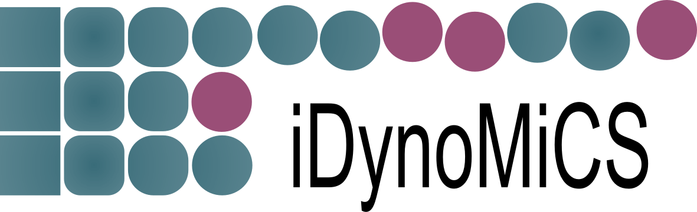

## Licence

iDynoMiCS is available under the [CeCILL license V2](http://www.cecill.info/index.en.html). iDynoMiCS 2 makes use of other third libraries and software, these libraries and software are referenced in the Java documentation as well as summorized in our [licence](LICENCE) file. The [CeCILL license V2](http://www.cecill.info/index.en.html) follows the principles of the [GNU general public license (GPL)](http://www.gnu.org/licenses/gpl-3.0.en.html) and of the [BSD license](https://opensource.org/licenses/BSD-3-Clause).

## getting started
read more about iDynoMiCS in the iDynoMiCS  [wiki](https://github.com/kreft/iDynoMiCS/wiki).

